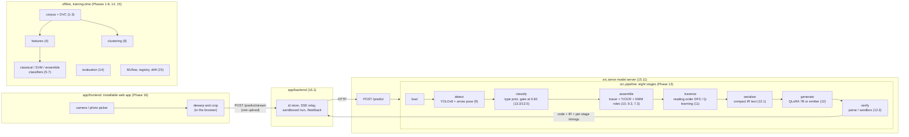

# DreamScript

Converting rough hand-drawn diagrams into executable, runnable code.

## Download the app

**[⬇ dreamscript-app-16.3.0.zip](https://github.com/guru-bharadwaj20/DreamScript/releases/download/v16.3.0/dreamscript-app-16.3.0.zip)**
(158 kB) · [SHA-256](https://github.com/guru-bharadwaj20/DreamScript/releases/download/v16.3.0/dreamscript-app-16.3.0.zip.sha256)
· [all releases](https://github.com/guru-bharadwaj20/DreamScript/releases/latest)
· [install guide](docs/install.md) · [what happens to your photo](docs/privacy.md)

It is an installable web app (a PWA), not an APK, so the same download runs on Android, iOS and a
desktop browser. Choose "Install" or "Add to Home Screen" and it opens full-screen like a native app.

**It needs a server to read photographs.** The models are 1.3 GB and run in Python, so the app
uploads the photo to a DreamScript backend and shows what comes back. With no backend it still
opens and shows five stored example readings, labelled as stored. To run the whole thing on one machine:

```bash
# in a clone of this repository, after `make env` (see Getting started)
uvicorn src.serve.api:app --port 8000                       # the model server
unzip dreamscript-app-16.3.0.zip
DREAMSCRIPT_BUNDLE=./dreamscript-app python -m uvicorn app.backend.main:app --port 3000
# then open http://localhost:3000
```

The phone camera only works over HTTPS or on `localhost`, so a phone on the LAN needs the
backend behind HTTPS. [docs/install.md](docs/install.md) covers that.

---

Photograph a messy hand-drawn diagram — flowchart, UI wireframe, state machine, ER diagram, or
circuit — and DreamScript classifies the diagram type, detects its components despite bad
handwriting and broken arrows, parses it into a semantic graph, and generates runnable code:
Python, React, SQL or SPICE.

```bash
uvicorn src.serve.api:app --port 8000          # or: make serve
curl -F "image=@page.png" localhost:8000/predict
```

**Author:** Guru Bharadwaj

---

## Architecture



A photograph is uploaded once. Each stage returns either a value or a reason, and the run stops at
the first stage that has no value (`stopped_at`). Every stage is timed, and the timings stream back
to the phone as they finish. Below a 0.60 type probability the pipeline asks the user to confirm the
diagram type instead of generating code.

## Getting started

```bash
make env          # venv + all eight requirements layers + the pre-commit hooks
make verify       # prove every installed stack answers
make test         # the suite (~7,000 tests, ~5 minutes)
make lint         # ruff + black + isort + mypy against its baseline
```

On Windows without GNU make, `./tasks.ps1 <target>` mirrors every Makefile target one for one;
`./tasks.ps1 help` lists them.

**The data does not come with the clone.** `data/` is DVC pointers in git and the store is a
directory on one machine — see [docs/data_remote.md](docs/data_remote.md), which says so plainly
and lists what that costs. Everything below that does not need the corpus runs anywhere.

## What runs what

Each package is a command. `python -m src.<package>` with no arguments lists what is in it;
`make stages` prints all eleven at once.

| | | |
| :--- | :--- | :--- |
| `src.ingest` | Phase 1 | the corpus manifest, splits, dedup, licence audit |
| `src.preprocess` | Phase 3 | photograph → clean ink, text/shape layers, primitives |
| `src.features` | Phase 4 | the handcrafted feature table |
| `src.classify` | Phases 5–7 | diagram-type classifiers, from a decision tree to an ensemble |
| `src.detect` | Phase 9.1–9.2 | the YOLO component detector and the arrow pose model |
| `src.ocr` | Phase 9.3 | handwriting recognition |
| `src.parse` | Phases 7.3, 10 | HMM roles and graph assembly into the IR |
| `src.assemble` | Phase 10 | the S5 assembly stages and what they are scored on |
| `src.ir` | Phase 2 | the intermediate representation, its schema and its converters |
| `src.codegen` | Phase 12.1 | IR → code, and the training pairs |
| `src.llm` | Phase 12.2 | the QLoRA fine-tune |
| `src.rl` | Phase 11 | the traversal policy |
| `src.eval` | Phase 14 | the master table, ablations and error analysis |
| `src.pipeline` | Phase 13 | the eight stages composed into one call |
| `src.serve` | Phase 15.11 | the inference service |
| `src.mlops` | Phase 15 | tracking, registry, drift, retraining triggers |

```python
from src.pipeline import DreamScriptPipeline
result = DreamScriptPipeline().run("page.png")
result.code, result.diagram_type, result.timing_table()
```

## Where things are

| Path | |
| :--- | :--- |
| [contributing.md](contributing.md) | the phase-by-phase build plan — 761 rows, and the record of every decision |
| [configs/README.md](configs/README.md) | all thirteen configs, and which of them steer code |
| [reports/README.md](reports/README.md) | every report and the command that writes it |
| [docs/conventions.md](docs/conventions.md) | naming, run directories, git, code and config rules |
| [docs/data_remote.md](docs/data_remote.md) | why `dvc pull` works on one machine |
| [docs/data_losses.md](docs/data_losses.md) | the four raw sources whose content exists nowhere |
| [docs/hardware.md](docs/hardware.md) | what this was measured on |
| [docs/risks.md](docs/risks.md) | what could make the results wrong |
| [models/README.md](models/README.md) | downloaded weights vs. the ones produced here |
| `dvc.yaml` | the twelve-stage pipeline; four are frozen because they cost GPU-days |

## Results

The headline table is [reports/master_results.md](reports/master_results.md), and every number in
it names the artefact it was read from. `python -m src.eval master` rebuilds it from the four
artefacts it reads; `make eval` rebuilds those first.

## A note on the plan document

`contributing.md` is 457 KB across 761 rows because it is a build log as much as a plan: each row
carries what was tried, what was measured, and why the decision went the way it did. That is
deliberate and it is not a substitute for this file — if you are looking for how to run something,
it is above, and if you are looking for why something is the way it is, it is there.
