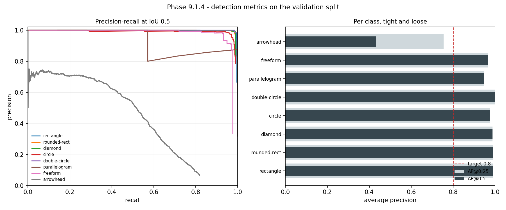
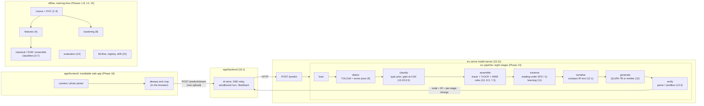

# DreamScript

**Photograph a messy hand-drawn diagram, get code that runs, and see exactly how far to trust it.**

[](https://github.com/guru-bharadwaj20/DreamScript/releases/download/v16.3.0/dreamscript-app-16.3.0.zip)
[](pyproject.toml)
[](app/frontend/package.json)
[](tests)
[](contributing.md)
[](LICENSE)

DreamScript takes one phone photo of a whiteboard or paper sketch (a flowchart, state machine, ER
diagram, UI wireframe or circuit). It works out the diagram type, finds every box and arrow despite
bad handwriting, reads the labels, builds a graph, and writes a program: Python, React, SQL or
SPICE. Every stage reports how sure it is, and when it is not sure of the diagram type it asks
instead of guessing.

**The measurement is the point of the project.** Ten success criteria were fixed before any model
was trained. Each one is scored on writers the models never saw, and the two that miss are
reported as misses.

<p align="center">
  
  
</p>
<p align="center"><sub>Left: a real input from the held-out set, photographed on a desk. Right: the detector on the validation split, where the arrowhead is the one weak class.</sub></p>

---

## Download the app

**[⬇ dreamscript-app-16.3.0.zip](https://github.com/guru-bharadwaj20/DreamScript/releases/download/v16.3.0/dreamscript-app-16.3.0.zip)**
(158 kB) · [SHA-256](https://github.com/guru-bharadwaj20/DreamScript/releases/download/v16.3.0/dreamscript-app-16.3.0.zip.sha256)
· [all releases](https://github.com/guru-bharadwaj20/DreamScript/releases/latest)
· [install guide](docs/install.md) · [what happens to your photo](docs/privacy.md)

It is an installable web app (a PWA), not an APK, so the same download runs on Android, iPhone and
desktop. Choose **Install** or **Add to Home Screen** and it opens full screen like a native app.

> [!IMPORTANT]
> **Reading a photograph needs a server.** The models are 1.3 GB of Python, so the app uploads the
> photo and shows what comes back. With no server, the app still opens and shows five stored
> example readings, labelled as stored. To run the full stack on one machine, see
> [Quick start](#quick-start).

---

## Contents

| Section | |
|---|---|
| [Where it stands](#where-it-stands) | The ten criteria, and what the misses mean |
| [Architecture](#architecture) | Client, backend, model server, eight stages |
| [Quick start](#quick-start) | Environment, tests, running it |
| [What runs what](#what-runs-what) | Every package is a command |
| [Project status](#project-status) | Every phase, and the five open rows |
| [Design decisions](#design-decisions) | The tradeoffs, and why |
| [Repository layout](#repository-layout) | Where things live |
| [Documentation](#documentation) | Which file answers which question |

---

## Where it stands

Scored on held-out data, with **writers split so no scribe is on both sides**. Every number is
read from [reports/master_results.md](reports/master_results.md), which names the artefact it came
from.

| # | Criterion | Target | Result | |
|:-:|---|---|---|:-:|
| S1 | Diagram-type accuracy (held-out scribes) | ≥ 0.92 | **0.9871** | ✅ |
| S2 | Component detection mAP@0.5 | ≥ 0.80 | **0.9107** | ✅ |
| S3 | Label OCR character error rate | ≤ 0.15 | **0.2006** | ❌ |
| S4 | HMM role macro F1 | ≥ 0.80 | **0.8003** | ✅ |
| S5 | Median graph edit distance (test) | ≤ 3 | **13** (val 3) | ❌ |
| S6 | Generated code executes | ≥ 85% | **98.8%** | ✅ |
| S7 | Functional pass@1 | ≥ 70% | **70.37%** | ✅ |
| S8 | Photo → code latency | < 10 s | **2.71 s** median | ✅ |
| S9 | Live capture, messy sketch, first try | yes | client shipped, demo pending | — |
| S10 | All four syllabus units covered | yes | [syllabus map](docs/syllabus_map.md) | ✅ |

**Read S6/S7 with S5.** The code model is measured from a correct graph. From a photograph,
**19.1%** of programs pass their behavioural test, because the graph built from the photo is
often wrong in ways that break the program.

### Findings worth more than the metrics

| | |
|---|---|
| 🎯 **The bottleneck is the graph, not the reading** | Swapping in predicted components one at a time: wrong OCR costs 0.13 pass@1, and a wrong graph structure costs **0.56**. Future work is ordered by this. |
| 🚫 **Confidently wrong on unseen types** | On ER diagrams, circuits and wireframes, which the detector never trained on, **21 of 24 pages** produced runnable, wrong code at confidence ≈ 1.0. The confirmation gate cannot catch a type the router has never seen. |
| 🤖 **RL was implemented and not needed** | Q-learning traversal adds +0.026 semantic score over a plain DFS, and executability is unchanged, so the pipeline ships the DFS. |
| 🧪 **S1 is real but inflated** | Two corpora are single-class, so the source predicts the label for 1,200 of 1,340 pages. The confound is documented next to the number. |
| 📐 **Rotation, not blur** | Blur costs almost nothing. Six degrees of rotation cuts node F1 from 0.99 to 0.40, so the client dewarps the photo before upload. |

**→ [Full report: method, results, ablations, limitations](docs/report.md)**

---

## Architecture



A photograph is uploaded once. Each stage returns either a value or a reason, and the run stops at
the first stage that has no value (`stopped_at`). Every stage is timed, and the timings stream back
to the phone as they finish. Below a 0.60 type probability, the pipeline asks for confirmation
instead of guessing. Generated code runs only in the server sandbox.

| Stage | Model | Card |
|---|---|---|
| detect | YOLOv8n at 1280 px | [detector](docs/model_cards/detector.md) |
| classify | multinomial Naive Bayes over detected classes | [nb_router](docs/model_cards/nb_router.md) |
| assemble | tracer + YOLOv8m-pose arrows + TrOCR-large + HMM/Viterbi | [arrows](docs/model_cards/arrow_pose.md) · [ocr](docs/model_cards/ocr_trocr.md) · [hmm](docs/model_cards/hmm_roles.md) |
| generate | Qwen2.5-Coder-7B + QLoRA r=64, or a deterministic emitter | [synth_lora](docs/model_cards/synth_lora.md) |

---

## Quick start

```bash
make env          # venv + all eight requirements layers + the pre-commit hooks
make verify       # prove every installed stack answers
make test         # the suite (~7,000 tests, ~5 minutes)
make lint         # ruff + black + isort + mypy against its baseline
```

On Windows without GNU make, `./tasks.ps1 <target>` mirrors every Makefile target one for one.

> [!NOTE]
> **The data does not come with the clone.** `data/` is DVC pointers, and the store is a directory
> on one machine. See [docs/data_remote.md](docs/data_remote.md). Everything that does not need
> the corpus runs anywhere.

<details>
<summary><b>Run the full stack</b>: model server, app backend and the installable client</summary>

```bash
# 1. model server on :8000
uvicorn src.serve.api:app --port 8000          # or: make serve
curl -F "image=@tests/fixtures/flowchart.png" localhost:8000/predict

# 2. app backend on :3000, serving the downloaded client bundle
unzip dreamscript-app-16.3.0.zip
DREAMSCRIPT_BUNDLE=./dreamscript-app python -m uvicorn app.backend.main:app --port 3000
```

Open http://localhost:3000. The phone camera only works over HTTPS or on `localhost`, so a phone on
the LAN needs the backend behind a certificate; [docs/install.md](docs/install.md) covers this.
Every route is in [docs/api.md](docs/api.md).
</details>

<details>
<summary><b>Use it from Python</b></summary>

```python
from src.pipeline import DreamScriptPipeline
result = DreamScriptPipeline().run("page.png")
result.code, result.diagram_type, result.timing_table()
```
</details>

---

## What runs what

Each package is a command. `python -m src.<package>` with no arguments lists what is in it, and
`make stages` prints them all.

| | | |
| :--- | :--- | :--- |
| `src.ingest` | Phase 1 | the corpus manifest, splits, dedup, licence audit |
| `src.preprocess` | Phase 3 | photograph → clean ink, text/shape layers, primitives |
| `src.features` | Phase 4 | the handcrafted feature table |
| `src.classify` | Phases 5–7 | diagram-type classifiers, from a decision tree to an ensemble |
| `src.detect` | Phase 9.1–9.2 | the YOLO component detector and the arrow pose model |
| `src.ocr` | Phase 9.3 | handwriting recognition |
| `src.parse` | Phases 7.3, 10 | HMM roles and graph assembly into the IR |
| `src.assemble` | Phase 10 | the S5 assembly stages and what they are scored on |
| `src.ir` | Phase 2 | the intermediate representation, its schema and its converters |
| `src.codegen` | Phase 12.1 | IR → code, and the training pairs |
| `src.llm` | Phase 12.2 | the QLoRA fine-tune |
| `src.rl` | Phase 11 | the traversal policy |
| `src.eval` | Phase 14 | the master table, ablations and error analysis |
| `src.pipeline` | Phase 13 | the eight stages composed into one call |
| `src.serve` | Phase 15.11 | the inference service |
| `src.mlops` | Phase 15 | tracking, registry, drift, retraining triggers |

---

## Project status

**303 of 308 plan rows are done.** [contributing.md](contributing.md) is the authority. Each row
records what was tried, what was measured, and why the decision went the way it did.

| Phase | Scope | Done |
|---|---|:-:|
| 0–4 | Foundations, data, annotation schema, preprocessing, features | ✅ |
| 5–8 | Classical ML, ANN/SVM, ensembles/NB/HMM/GMM, clustering | ✅ |
| 9–11 | CNN detection and OCR, graph assembly, RL traversal | ✅ |
| 12 | QLoRA code synthesis | 24/26 |
| 13–15 | Orchestration, evaluation, MLOps | ✅ |
| 16 | Installable client and capture | 19/20 |
| 17 | Documentation, report, demo | 8/10 |

**Five rows remain open, and none of them is code that can be written here:**

| Row | Item | Why it is not closed |
|---|---|---|
| 12.1.3 | Hand-written reference programs | 260+ programs need to be written by a person |
| 12.3.3 | Functional correctness vs. the references' ceiling | The model is below the 78.4% the references themselves reach |
| 16.3.3 | Release built by CI | Blocked on GitHub Actions billing. The workflow is written, and a tag will run it |
| 17.8 | Demo rehearsal | [The script](docs/demo.md) is written. It has to be rehearsed on a real phone |
| 17.9 | Demo video | Has to be recorded against a running server |

---

## Design decisions

**An IR between vision and code.** Every stage after detection reads and writes one
JSON-Schema-validated graph. That is what makes each stage measurable on its own, and what let the
error-propagation study find the real bottleneck.

**Refuse rather than guess.** Code generators are type-specific, so runnable Python for what is
actually an ER diagram is worse than a question. Below 0.60 the pipeline asks. Uncertain edges,
crossed-out shapes and low-confidence text are carried in the IR, not dropped.

**A thin client, a heavy server.** The recogniser and detector do not fit on a phone without losing
exactly the accuracy that S3 and S5 are short of. The phone captures, dewarps and displays, and the
Python pipeline answers over HTTP.

**A web app, not an APK.** It has to run on iOS, and nothing in the toolchain builds Android
binaries. Installed, a PWA opens full screen, and one download serves every platform.

**Code runs only in a sandbox.** `POST /run/{id}` takes an id, never a program. Python gets
128 MB, a module blocklist and a timeout, so a generated program can never touch the user's machine.

**Ship the simpler model when the ablation says so.** The RL traversal and the learned GMM shapes
were built, measured, and left out of the served path, because the ablation said they did not help.

---

## Repository layout

```
.
├── src/            one package per stage: ingest → preprocess → … → pipeline, serve, mlops
├── app/
│   ├── backend/    FastAPI: id store, SSE relay, sandboxed /run, correction log
│   └── frontend/   Vite + React + TypeScript installable client
├── schemas/        the IR's JSON Schemas
├── configs/        thirteen configs, one per stage
├── notebooks/      one per syllabus unit, reading committed results
├── reports/        every measured result, with the figures in reports/figures/
├── docs/           report, API, model cards, data cards, demo, viva
├── scripts/        release packaging, notebook generation
├── tests/          ~7,000 tests
└── dvc.yaml        the twelve-stage data pipeline
```

---

## Documentation

| Question | File |
|---|---|
| *What was built, and how well does it work?* | [docs/report.md](docs/report.md) |
| *Where did this number come from?* | [reports/master_results.md](reports/master_results.md) · [reports/README.md](reports/README.md) |
| *Why is it built this way?* | [contributing.md](contributing.md): 761 rows, every decision |
| *What does this endpoint / IR field mean?* | [docs/api.md](docs/api.md) |
| *What is each model, and where does it fail?* | [docs/model_cards/](docs/model_cards/README.md) |
| *Which syllabus unit is where?* | [docs/syllabus_map.md](docs/syllabus_map.md) · `notebooks/` |
| *How do I install the app?* | [docs/install.md](docs/install.md) |
| *What happens to my photo?* | [docs/privacy.md](docs/privacy.md) |
| *Why won't `dvc pull` work?* | [docs/data_remote.md](docs/data_remote.md) · [docs/data_losses.md](docs/data_losses.md) |
| *What could make the results wrong?* | [docs/risks.md](docs/risks.md) · [docs/hardware.md](docs/hardware.md) |
| *Presenting it?* | [docs/demo.md](docs/demo.md) · [docs/viva.md](docs/viva.md) |
| *Code and config rules?* | [docs/conventions.md](docs/conventions.md) · [configs/README.md](configs/README.md) · [models/README.md](models/README.md) |

---

## Author

| | |
|---|---|
| **Guru Bharadwaj** | Everything: data, models, pipeline, client, evaluation |

## License

[MIT](LICENSE).

---

*Generated code is a draft to review, not a verified program. Photos are uploaded to the server the
app is pointed at. [docs/privacy.md](docs/privacy.md) says what it keeps.*
