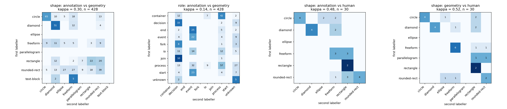

# Inter-Annotator Agreement

Phase 2.2.4. Generated by `python -m src.ir.agreement`.

**50 hdBPMN diagrams, 877 annotated regions** at least 24px on a side, sampled with seed 42.

The sample is split in half by diagram. Labeller B's thresholds were set from the **calibration** half only, so every kappa below is computed on the **evaluation** half - 428 regions those thresholds never saw. For comparison, shape agreement is 0.396 on the half it was tuned on and 0.300 on the half it was not.

## Who the annotators are

This project does not have two human annotation teams, and this report does not
pretend otherwise. Three labellers of different kinds were compared:

| Labeller | Sees | Is |
| :--- | :--- | :--- |
| **A - annotation** | the hdBPMN XML | the dataset's own human annotation. Roles are ground truth; shapes are the BPMN drawing convention applied to those roles |
| **B - geometry** | only the pixels in each box | `src/ir/convert/geometry.py`, blind to the label |
| **C - human** | the same crops as an unlabelled contact sheet | one person, 30 crops |

## Results

| Pairing | n | raw agreement | Cohen's kappa |
| :--- | ---: | ---: | ---: |
| shape: annotation vs geometry | 428 | 0.425 | **0.300** |
| role: annotation vs geometry | 428 | 0.273 | **0.144** |
| shape: annotation vs human | 30 | 0.567 | **0.479** |
| shape: geometry vs human | 30 | 0.600 | **0.519** |



Kappa is read on the usual scale: below 0.4 poor, 0.4-0.6 moderate, 0.6-0.8
substantial, above 0.8 near-perfect.

## The headline, before the detail

**plan.md 2.2.4 sets a bar of kappa >= 0.75. Nothing here reaches it; the best pairing is 0.52.** That is the finding, not a missing piece of work, and three things follow from it:

1. **The BPMN drawing convention is a worse account of what was drawn than a crude contour classifier is** - kappa 0.48 against the human, versus 0.52 for the geometry. Writers do not draw tasks as rounded rectangles. Every hdBPMN shape label carries `shape_basis: bpmn-convention` for exactly this reason, and no phase may treat those shapes as ground truth.
2. **Shape labels for hand-drawn diagrams have to be annotated, not derived.** Phase 5 cannot be trained on hdBPMN-derived shapes and then be said to classify shape; it would be learning to reproduce a convention.
3. **Reaching 0.75 needs two people and the guidelines**, which is what `docs/annotation_guide.md` and the Label Studio project in 2.2.1 exist to make possible. This report is the baseline they would be measured against.

## What each number means

### Shape, annotation against geometry

kappa = 0.300 over 428 regions. This is the number that matters most in this report, because **every hdBPMN shape label in this project is a convention, not an observation** - the XML says an element is a `task` and the converter writes `rounded-rect`. This measures how often that convention matches the pen.

Shape distributions, side by side:

| shape | A (BPMN convention) | B (from the pixels) |
| :--- | ---: | ---: |
| circle | 232 | 173 |
| diamond | 137 | 210 |
| ellipse | 0 | 65 |
| freeform | 90 | 110 |
| parallelogram | 0 | 28 |
| rectangle | 129 | 105 |
| rounded-rect | 279 | 186 |
| text-block | 10 | 0 |

### Role, annotation against geometry

kappa = 0.144. **A low number here is the expected result, not a defect.** Labeller B assigns a role from the shape alone, and a circle in a flowchart may be a start, an end or an intermediate event with nothing in its own pixels to separate them. What this bounds is how far shape classification alone can go: it is the reason Phase 10 assembles a graph before anything claims to know what a node means, and the reason Phase 5's classifier is scored on shape rather than role.

### The human pass

A person labelled 30 crops from the contact sheet in `reports/figures/p2_crop_sheet.png`, seeing only the ink - no BPMN label, no neighbouring shapes, no file name.

* against the BPMN convention: kappa = **0.479** (raw agreement 57%)
* against the geometry classifier: kappa = **0.519** (raw agreement 60%)

This is the closest thing in the project to true inter-annotator agreement, and it is one person on a small sample rather than two teams on fifty images. It is reported as what it is.

## Limitations, stated plainly

| Limitation | Why it matters |
| :--- | :--- |
| Only hdBPMN is measured | It is the one source with both an image and a human structural annotation. The chaos corpus has no per-shape labels to disagree with |
| A is not an independent annotator | It is the dataset's own annotation, so A vs B measures convention-versus-pixels, not two people |
| B is crude by design | Douglas-Peucker on one contour. Phase 3.2 replaces it, and these numbers are the baseline it must beat |
| Regions under 24px are excluded | Mostly event circles and text labels. Excluding them flatters every number here, and the exclusion is stated rather than hidden |
| One human, one sample | Real IAA needs two people who did not write the guidelines. Phase 2.2.3 exists so that becomes possible; this is not it |

## Reproducing

```
python -m src.ir.agreement --sheet     # build the blind contact sheet
#   label it into data/annotations/human_shape_sample.csv
python -m src.ir.agreement --limit 50  # recompute and rewrite this report
```
