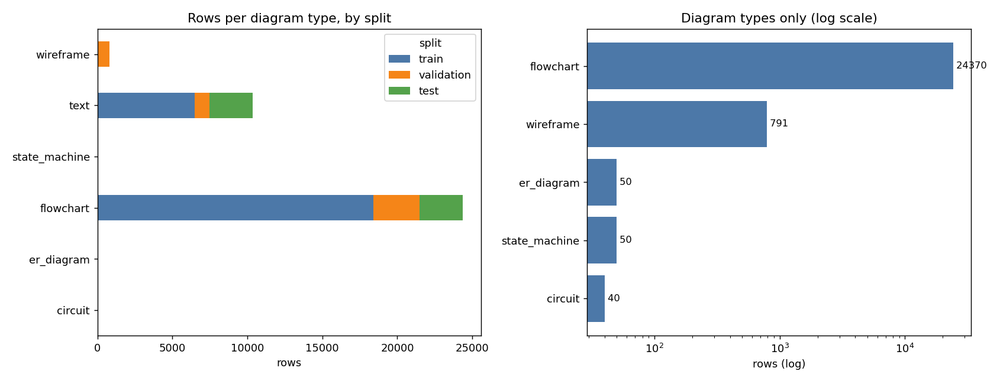

# Class Balance

Phase 1.3.4. Generated by `python -m src.ingest.balance`.

## Rows per diagram type and split

| diagram type | train | validation | test | total |
| :--- | ---: | ---: | ---: | ---: |
| circuit | 28 | 6 | 6 | 40 |
| er_diagram | 30 | 10 | 10 | 50 |
| flowchart | 18423 | 3045 | 2902 | 24370 |
| state_machine | 34 | 8 | 8 | 50 |
| text | 6482 | 976 | 2915 | 10373 |
| wireframe | 40 | 747 | 4 | 791 |

## Rows per source and diagram type

| source | circuit | er_diagram | flowchart | state_machine | text | wireframe |
| :--- | ---: | ---: | ---: | ---: | ---: | ---: |
| chaos | 40 | 50 | 60 | 50 | 0 | 60 |
| didi | 0 | 0 | 22287 | 0 | 0 | 0 |
| flowchartseg | 0 | 0 | 1319 | 0 | 0 | 0 |
| hdbpmn | 0 | 0 | 704 | 0 | 0 | 0 |
| iam_line | 0 | 0 | 0 | 0 | 10373 | 0 |
| sketch2code | 0 | 0 | 0 | 0 | 0 | 731 |

## The imbalance, stated plainly

Largest class is **609x** the smallest.

This is not a corpus of five equal diagram types. It is dominated by flowchart-like
diagrams, because that is what the public datasets contain: hdBPMN, DIDI and
flowchartseg are all flowchart-shaped, while the other four types exist only in the
curated chaos corpus at 40-60 images each.

### What this forces downstream

| Consequence | Where it is handled |
| :--- | :--- |
| Accuracy is meaningless here - predicting `flowchart` always would score well | Phase 5.2.3 reports **macro**-F1 and per-class precision/recall |
| The minority types need their own PR curves, not just a global ROC | Phase 5.2.5 |
| Ensembles will ignore rare classes unless reweighted | Phase 7.1: class weights / balanced sampling |
| A stratified split alone cannot fix a 30:1 ratio | Phase 1.3.6 augmentation, and the synthetic generator in 1.3.7, target the minority types |
| Reported gains may come from the majority class alone | Phase 14.2 reports per-type metrics separately |

### Why it is not simply corrected here

Down-sampling the majority would throw away the only large, well-annotated data the
project has - hdBPMN's edge annotations are what Phase 10 learns from. The imbalance
is therefore kept and handled at the metric and sampling level, where it stays
visible, rather than hidden by resampling the corpus.
