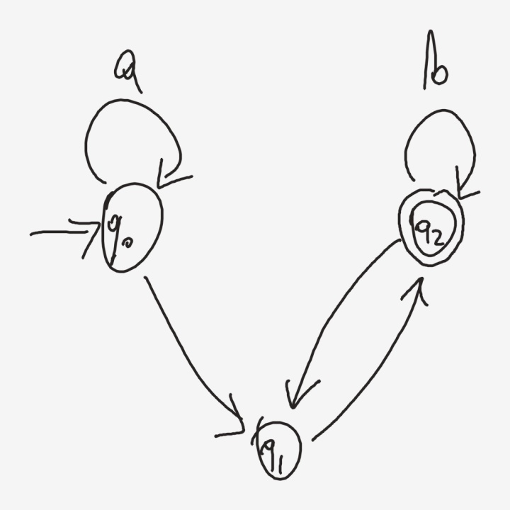
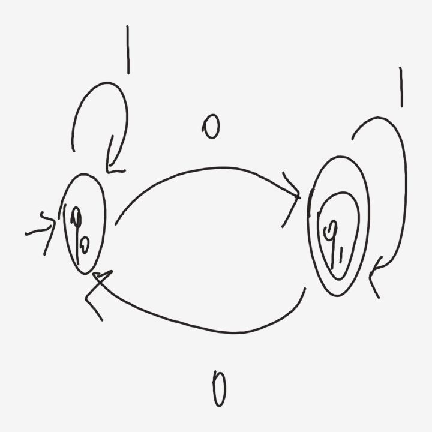
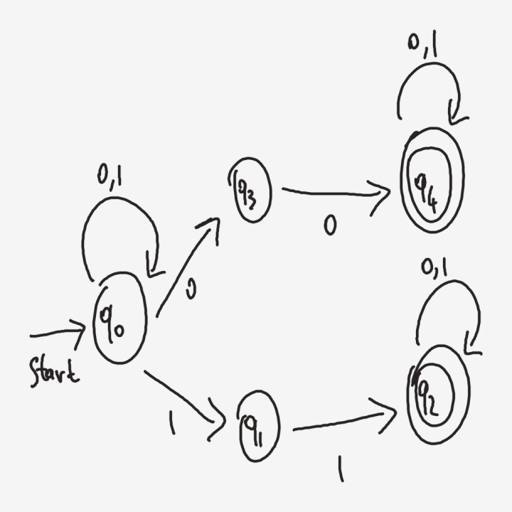
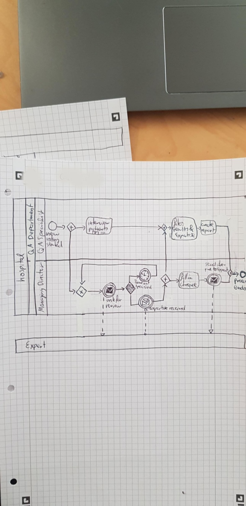
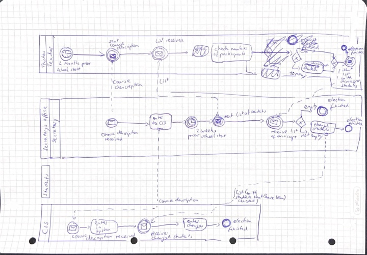
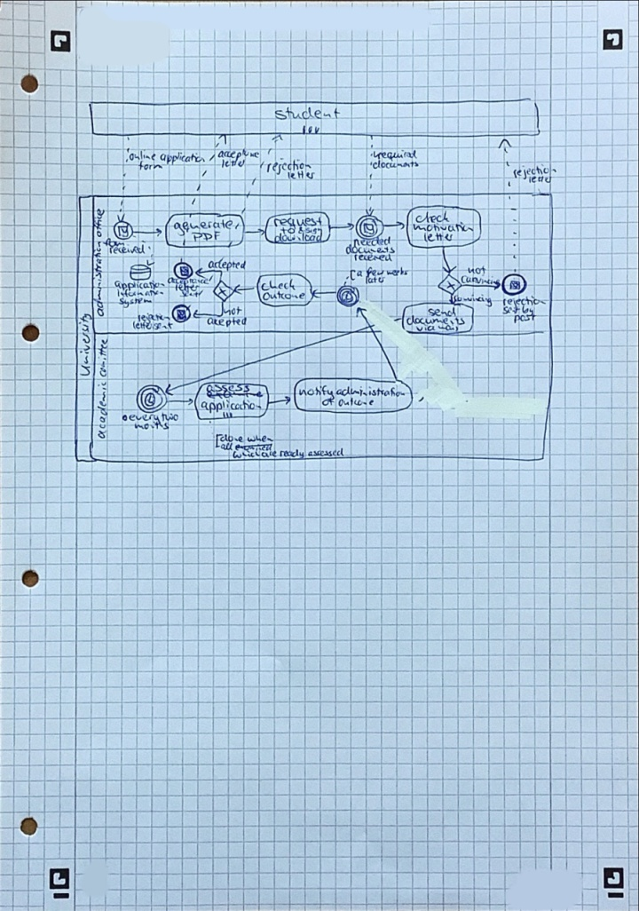

# Phase 14.9 - qualitative gallery

Generated by `python -m src.eval.gallery --each 3`. The order is the criterion's own (`reports/s5_test_large.json, ascending graph edit distance`), computed before this module existed; the best and worst entries are the two ends of it, taken symmetrically, so nothing here is hand-picked. Each entry shows the photograph, the criterion's numbers for that page, and the head of the program 12.1.6 emitted **from the predicted IR** - the code a user would have received, not the reference.

## Best cases

### `fa_bresler__writer015_fa_001` (fa_bresler) - GED 0.0



* node F1 1.0, edge F1 1.0
* edits: {"sub_text": 0, "edge_insert": 0, "edge_delete": 0, "node_insert": 0, "node_delete": 0}
* end to end: fails: `no_acceptor` (from the annotated IR: passes)

```python
def run_diagram(ctx):
    state = "d000"
    pending = []
    while True:
        if state == "d000":
            ctx = q0(ctx)
            if q0(ctx):
                state = "d000"
            else:
                state = "d002"
        elif state == "d002":
            ctx = q1(ctx)
            state = "d001"
        elif state == "d001":
            ctx = q2(ctx)
            if q2(ctx):
                state = "d002"
            else:
```

(24 lines in full)

### `fa_bresler__writer015_fa_004` (fa_bresler) - GED 0.0



* node F1 1.0, edge F1 1.0
* edits: {"sub_text": 0, "edge_insert": 0, "edge_delete": 0, "node_insert": 0, "node_delete": 0}
* end to end: fails: `no_acceptor` (from the annotated IR: passes)

```python
def run_diagram(ctx):
    state = "d001"
    pending = []
    while True:
        if state == "d001":
            ctx = q1(ctx)
            if q1(ctx):
                state = "d001"
            else:
                state = "d000"
        elif state == "d000":
            ctx = q0(ctx)
            if q0(ctx):
                state = "d001"
            else:
                state = "d000"
        else:
            if pending:
```

(21 lines in full)

### `fa_bresler__writer015_fa_007` (fa_bresler) - GED 0.0



* node F1 1.0, edge F1 1.0
* edits: {"sub_text": 0, "edge_insert": 0, "edge_delete": 0, "node_insert": 0, "node_delete": 0}
* end to end: fails: `no_acceptor` (from the annotated IR: passes)

```python
def run_diagram(ctx):
    state = "d002"
    pending = ["d000", "d003"]
    while True:
        if state == "d002":
            ctx = q4(ctx)
            state = "d002"
        elif state == "d000":
            ctx = q3(ctx)
            state = "d002"
        elif state == "d003":
            ctx = q0(ctx)
            if q0(ctx):
                state = "d000"
            elif q0(ctx):
                state = "d003"
            else:
                state = "d004"
```

(29 lines in full)

## Worst cases

### `hdbpmn__ex07_writer0088` (hdbpmn) - GED 46.0



* node F1 0.9268, edge F1 0.069
* edits: {"sub_text": 16, "edge_insert": 7, "edge_delete": 20, "node_insert": 1, "node_delete": 2}
* end to end: fails: `never_returns` (from the annotated IR: passes)

```python
def run_diagram(ctx):
    state = "d031"
    pending = ["d013", "d000", "d006", "d010", "d009", "d016", "d019", "d017", "d004", "d014", "d007", "d011", "d008", "d005", "d012"]
    while True:
        if state == "d031":
            ctx = send_welcome_pack(ctx)
            if pending:
                state = pending.pop(0)
                continue
            return ctx
        elif state == "d013":
            ctx = handling_department(ctx)
            if pending:
                state = pending.pop(0)
                continue
            return ctx
        elif state == "d000":
            ctx = files_results_of_expertise(ctx)
```

(122 lines in full)

### `hdbpmn__ex08_writer0101` (hdbpmn) - GED 46.0



* node F1 0.8387, edge F1 0.717
* edits: {"sub_text": 21, "edge_insert": 7, "edge_delete": 7, "node_insert": 9, "node_delete": 1}
* end to end: fails: `missing_operation` (from the annotated IR: passes)

```python
def run_diagram(ctx):
    state = "d042"
    pending = ["d024", "d002", "d027", "d020", "d016", "d026", "d050", "d000", "d030", "d005", "d013", "d028", "d032"]
    while True:
        if state == "d042":
            ctx = claims_officer(ctx)
            if pending:
                state = pending.pop(0)
                continue
            return ctx
        elif state == "d024":
            ctx = teacher(ctx)
            if pending:
                state = pending.pop(0)
                continue
            return ctx
        elif state == "d002":
            ctx = teacher(ctx)
```

(191 lines in full)

### `hdbpmn__ex09_writer0092` (hdbpmn) - GED 47.0



* node F1 0.9545, edge F1 0.0625
* edits: {"sub_text": 15, "edge_insert": 9, "edge_delete": 21, "node_insert": 0, "node_delete": 2}
* end to end: passes its functional test (from the annotated IR: passes)

```python
def run_diagram(ctx):
    state = "d018"
    pending = ["d009", "d003", "d014", "d015", "d005", "d008", "d013", "d016", "d010", "d019", "d007", "d020", "d006", "d000", "d012"]
    while True:
        if state == "d018":
            ctx = claims_officer(ctx)
            if pending:
                state = pending.pop(0)
                continue
            return ctx
        elif state == "d009":
            ctx = check_motivation_letter(ctx)
            if pending:
                state = pending.pop(0)
                continue
            return ctx
        elif state == "d003":
            ctx = generate_pdf(ctx)
```

(133 lines in full)
