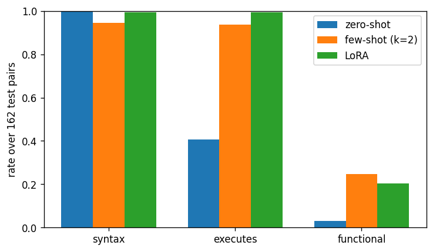

# Phase 12.2.7 - zero-shot vs few-shot vs LoRA (test)

`Qwen/Qwen2.5-Coder-7B-Instruct`, NF4, frozen 12.2.4 template (`dreamscript-codegen/v1`), greedy, all 162 test pairs. Few-shot: k=2 same-type train exemplars nearest in IR size, 96 train pairs excluded because their IR text also occurs in validation/test. `novel IR` = the 131 test pairs whose IR text never occurs in train (fa_bresler exercises repeat across writers).

| arm | contract | syntax | executes | functional pass@1 | functional (novel IR) | dropped nodes | invented/program | LoRA - arm, 95% CI | batch | ms/sample |
| :--- | :--- | :--- | :--- | :--- | :--- | :--- | :--- | :--- | :--- | :--- |
| zero-shot | 93.8% | 100.0% | 40.7% | 3.1% | 3.8% | 18.9% | 1.198 | (0.1049, 0.2469) | 8 | 8124.7 |
| few-shot (k=2) | 95.1% | 94.4% | 93.8% | 24.7% | 25.9% | 22.8% | 0.877 | (-0.0988, 0.0062) | 8 | 20605.6 |
| LoRA | 100.0% | 99.4% | 99.4% | 20.4% | 20.6% | 16.8% | 0.858 |  | 16 | 7354.9 |

**LoRA wins on functional pass@1: False**

