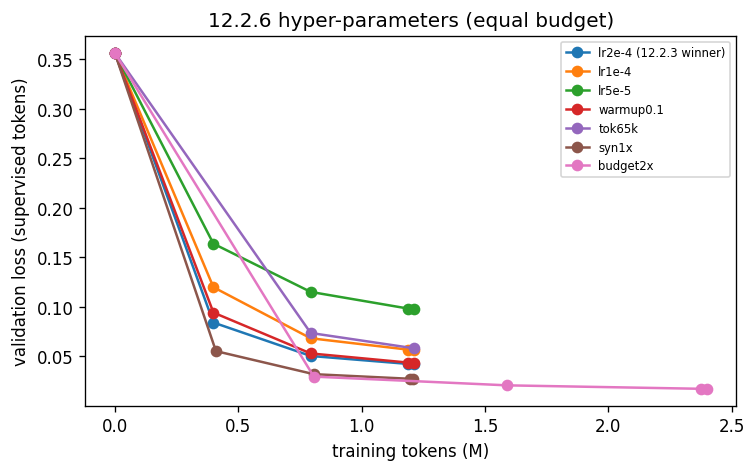

# Phase 12.2.6 - hyper-parameter sweep

Base `Qwen/Qwen2.5-Coder-7B-Instruct` with 12.2.3's `lora.r=64 lora.alpha=128`; 1,200,000 tokens per arm, coordinate search on validation loss (LR first, then warmup / tokens per step / synthetic mix against the LR winner), then the winner at 2x budget.

## LR

| arm | overrides | val loss @0 | best val loss | best step | steps | tokens | wall min | peak alloc GB | peak reserved GB | tokens/s |
| :--- | :--- | :--- | :--- | :--- | :--- | :--- | :--- | :--- | :--- | :--- |
| lr2e-4 (12.2.3 winner) | lora.r=64 lora.alpha=128 | 0.35647 | 0.04188 | 37 | 37 | 1212856 | 22.2 | 12.559 | 20.722 | 911.0 |
| lr1e-4 | train.lr=1e-4 | 0.35647 | 0.0563 | 37 | 37 | 1212856 | 22.2 | 12.559 | 20.722 | 909.0 |
| lr5e-5 | train.lr=5e-5 | 0.35647 | 0.09771 | 37 | 37 | 1212856 | 22.2 | 12.559 | 20.722 | 911.0 |

LR winner: **lr2e-4 (12.2.3 winner)**

## Warmup, batch (tokens per optimizer step), data mix

| arm | overrides | val loss @0 | best val loss | best step | steps | tokens | wall min | peak alloc GB | peak reserved GB | tokens/s |
| :--- | :--- | :--- | :--- | :--- | :--- | :--- | :--- | :--- | :--- | :--- |
| lr2e-4 (12.2.3 winner) (base) | lora.r=64 lora.alpha=128 | 0.35647 | 0.04188 | 37 | 37 | 1212856 | 22.2 | 12.559 | 20.722 | 911.0 |
| warmup0.1 | train.warmup_frac=0.1 | 0.35647 | 0.04337 | 37 | 37 | 1212856 | 22.2 | 12.559 | 20.722 | 911.0 |
| tok65k | train.tokens_per_step=65536 | 0.35647 | 0.0582 | 19 | 19 | 1212856 | 20.2 | 12.558 | 20.722 | 1000.0 |
| syn1x | data.synthetic_ratio=1.0 | 0.35647 | 0.02733 | 37 | 37 | 1208910 | 22.2 | 12.828 | 20.722 | 906.0 |

Winner: **syn1x** -> full-run overrides `lora.r=64 lora.alpha=128 data.synthetic_ratio=1.0`

## Budget (epochs proxy)

| arm | overrides | val loss @0 | best val loss | best step | steps | tokens | wall min | peak alloc GB | peak reserved GB | tokens/s |
| :--- | :--- | :--- | :--- | :--- | :--- | :--- | :--- | :--- | :--- | :--- |
| budget2x | 2x token budget | 0.35647 | 0.01725 | 73 | 73 | 2398437 | 39.2 | 12.828 | 20.722 | 1020.0 |

