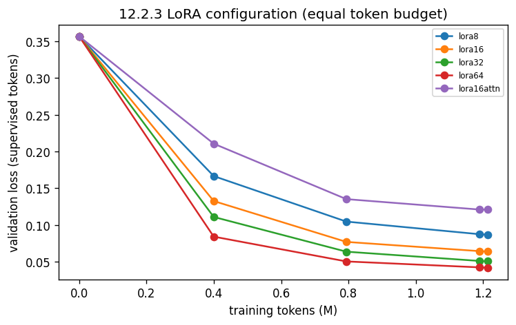

# Phase 12.2.3 - LoRA configuration sweep

Base `Qwen/Qwen2.5-Coder-7B-Instruct`, NF4, LR 2e-4, cosine, 1,200,000 training tokens per arm (same seed, so the same packed rows in the same order), validation loss over the 176 validation pairs' supervised tokens. alpha = 2r throughout.

| arm | overrides | val loss @0 | best val loss | best step | steps | tokens | wall min | peak alloc GB | peak reserved GB | tokens/s |
| :--- | :--- | :--- | :--- | :--- | :--- | :--- | :--- | :--- | :--- | :--- |
| lora8 | lora.r=8 lora.alpha=16 | 0.35647 | 0.08694 | 37 | 37 | 1212856 | 22.0 | 10.294 | 21.374 | 918.0 |
| lora16 | lora.r=16 lora.alpha=32 | 0.35647 | 0.06391 | 37 | 37 | 1212856 | 22.0 | 10.646 | 21.395 | 919.0 |
| lora32 | lora.r=32 lora.alpha=64 | 0.35647 | 0.05066 | 37 | 37 | 1212856 | 22.1 | 11.274 | 20.674 | 914.0 |
| lora64 | lora.r=64 lora.alpha=128 | 0.35647 | 0.04188 | 37 | 37 | 1212856 | 22.2 | 12.559 | 20.722 | 911.0 |
| lora16attn | lora.r=16 lora.alpha=32 lora.targets=[q_proj,k_proj,v_proj,o_proj] | 0.35647 | 0.1209 | 37 | 37 | 1212856 | 16.7 | 10.132 | 21.089 | 1211.0 |

**Selected: lora64** (lowest best validation loss).

