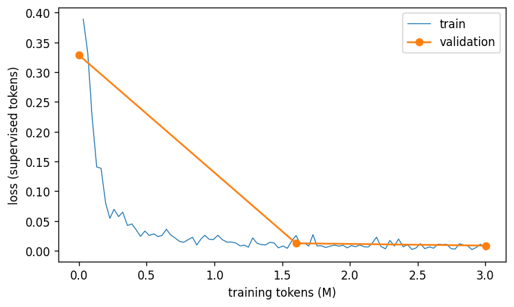

# Phase 12.2.5 - full QLoRA training run

Base `Qwen/Qwen2.5-Coder-7B-Instruct`; overrides `lora.r=64 lora.alpha=128 data.synthetic_ratio=1.0 train.epochs=1.0 train.eval_every=50`; run directory `experiments/llm/runs/20260919-094925_p12-qwen7b-full-s42`.

| arm | overrides | val loss @0 | best val loss | best step | steps | tokens | wall min | peak alloc GB | peak reserved GB | tokens/s |
| :--- | :--- | :--- | :--- | :--- | :--- | :--- | :--- | :--- | :--- | :--- |
| full | lora.r=64 lora.alpha=128 data.synthetic_ratio=1.0 train.epochs=1.0 train.eval_every=50 | 0.32861 | 0.00844 | 95 | 95 | 3001773 | 46.6 | 12.836 | 21.376 | 1074.0 |

## Data

```json
{
 "fa_bresler": {
  "examples": 204,
  "tokens": 230373
 },
 "hdbpmn": {
  "examples": 451,
  "tokens": 742714
 },
 "sketch2code": {
  "examples": 211,
  "tokens": 527248
 },
 "synthetic": {
  "examples": 11999,
  "tokens": 10034450
 },
 "synthetic_used": {
  "examples": 1811,
  "tokens": 1499759
 }
}
```

Dropped for exceeding 4,096 tokens (never truncated): `{'sketch2code': 273, 'synthetic': 1}`
Train/test contamination (exact IR text, ids, scribes): `{'diagram_ids': 0, 'scribes': 0, 'ir_texts': 20}`
Runtime checks: `{"attn_implementation": "sdpa", "gradient_checkpointing_flag": true, "training_mode": true, "gradient_checkpointing_effective": true, "linear4bit_modules": 196, "quant_types": ["nf4"], "trainable_params": 161480704, "stored_params": 4514452992, "weights_footprint_gb": 6.089, "gpu": "NVIDIA RTX 4500 Ada Generation", "gpu_total_gb": 25.76}`

Pack: `{"examples": 2677, "rows": 1411, "tokens": 3000094, "supervised_tokens": 1045291, "fill": 0.9717, "tokens_per_row": 2126.2, "own_row": 282, "truncated": 0}`


