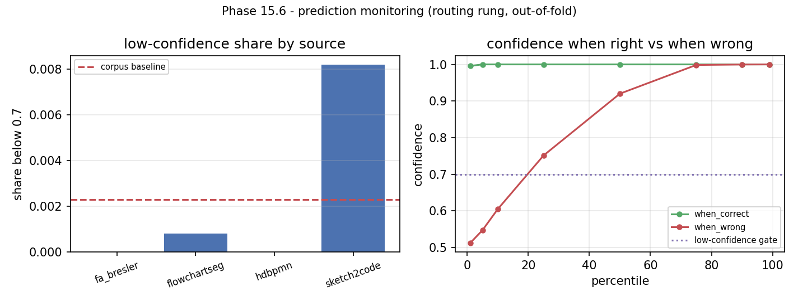

# Phase 15.6 - prediction monitoring

Generated by `python -m src.mlops.monitor`.

**What is monitored:** out-of-fold max predict_proba of 13.4's routing rung, grouped by writer.

**What deliberately is not:** runs/p13_golden stage confidences: six of seven stages are exactly 1.0 over 26 pages and the IR node confidences are all 1.0, so a monitor over them would report a straight line and call it a distribution.

## The distribution

3054 pages, mean 0.9983, **0.2% below the 0.7 gate**.

| percentile | p1 | p5 | p10 | p25 | p50 | p75 | p90 | p99 |
| :--- | ---: | ---: | ---: | ---: | ---: | ---: | ---: | ---: |
| confidence | 0.9898 | 0.9999 | 1.0 | 1.0 | 1.0 | 1.0 | 1.0 | 1.0 |

Percentiles rather than a mean, because the mean of a distribution this skewed hides exactly the tail the alarm exists to watch.

| source | pages | mean | share below gate |
| :--- | ---: | ---: | ---: |
| fa_bresler | 300 | 1.0 | 0.0 |
| flowchartseg | 1319 | 0.999 | 0.0008 |
| hdbpmn | 704 | 0.9995 | 0.0 |
| sketch2code | 731 | 0.9953 | 0.0082 |

## Is the confidence worth anything?

On the 3035 pages it gets right the router's mean confidence is **0.9992**; on the 19 it gets wrong it is **0.8529**. The two are separated, so the number carries information and a low reading is worth acting on.

## The spike alarm

A page is low confidence below **0.7**. A batch alarms when its low-confidence share is at least **3.0x** the corpus baseline (0.0023) **and** at least **0.02** in its own right.

**An additive margin was tried first and is the wrong shape**, which is recorded here because the failure is instructive rather than embarrassing: with a baseline of 0.0023, `baseline + 0.10` is 0.1023 - an absolute threshold wearing a margin's clothes, the very thing a margin exists to avoid. It scored a degraded batch running at 0.0867 - a **38x** increase - as no spike, because 8.67% is not 10%. The ratio is the form that travels between corpora; the floor is what keeps it from being hysterical near zero, where two uncertain pages in a thousand is '2x' and means nothing.

| control | what it asks | share | ratio | spiked | must spike | passes |
| :--- | :--- | ---: | ---: | :--- | :--- | :--- |
| `quiet` | clean held-out pages | 0.0 | 0.0 | no | no | yes |
| `spike` | the same pages, degraded | 0.0867 | 37.68 | **yes** | yes | yes |

A monitor that cannot stay quiet on clean held-out pages is measuring the split rather than the data, and one that cannot see a page photographed badly is not monitoring anything a deployment will meet. Both are required, and `--check` fails on either.

