# Phase 3.3.3 — preprocessing failure gallery

120 hdBPMN photographs through the full Phase 3 pipeline, ranked by the
worst of five signals. There is no pixel ground truth for these images — the ranking
is built from the annotation (a node box with no ink inside it is a lost shape) and
from properties any sane binarization of a page of ink has. `src/preprocess/failures.py`
explains each signal and why the score is a maximum rather than a sum.

Each thumbnail is the photograph beside the mask the pipeline produced.

## How the corpus divides

| diagnosis | pages |
| :--- | ---: |
| `clean` | 93 |
| `background_survived` | 9 |
| `shadow_left` | 8 |
| `off_page_background` | 6 |
| `fragmented` | 4 |

## The 20 worst

| # | page | diagnosis | score | shapes with no ink | ink share | fragmentation | straight-run residue |
| ---: | :--- | :--- | ---: | ---: | ---: | ---: | ---: |
| 1 | `ex00_writer0073.ir` | `off_page_background` | 4.63 | 0% of 12 | 16.4% | 0.5 | 0.25 |
| 2 | `ex01_writer0073.ir` | `off_page_background` | 4.30 | 0% of 11 | 14.2% | 0.7 | 0.32 |
| 3 | `ex01_writer0020.ir` | `off_page_background` | 4.27 | 0% of 11 | 12.4% | 1.4 | 0.29 |
| 4 | `ex00_writer0020.ir` | `off_page_background` | 4.02 | 0% of 13 | 13.2% | 1.2 | 0.24 |
| 5 | `ex00_writer0094.ir` | `shadow_left` | 1.68 | 0% of 11 | 28.3% | 0.2 | 0.11 |
| 6 | `ex01_writer0013.ir` | `off_page_background` | 1.22 | 0% of 10 | 4.0% | 1.2 | 0.43 |
| 7 | `ex01_writer0048.ir` | `shadow_left` | 0.47 | 0% of 11 | 11.7% | 3.0 | 0.01 |
| 8 | `ex00_writer0096.ir` | `shadow_left` | 0.40 | 0% of 12 | 23.6% | 0.9 | 0.07 |
| 9 | `ex00_writer0078.ir` | `off_page_background` | 0.38 | 0% of 12 | 19.1% | 0.7 | 0.15 |
| 10 | `ex00_writer0093.ir` | `shadow_left` | 0.38 | 0% of 12 | 17.4% | 0.7 | 0.09 |
| 11 | `ex00_writer0048.ir` | `shadow_left` | 0.34 | 0% of 10 | 13.7% | 2.0 | 0.02 |
| 12 | `ex01_writer0078.ir` | `background_survived` | 0.28 | 0% of 13 | 21.8% | 0.6 | 0.07 |
| 13 | `ex01_writer0015.ir` | `shadow_left` | 0.24 | 0% of 11 | 16.4% | 0.5 | 0.28 |
| 14 | `ex01_writer0058.ir` | `fragmented` | 0.21 | 0% of 11 | 2.5% | 6.1 | 0.04 |
| 15 | `ex01_writer0064.ir` | `background_survived` | 0.18 | 0% of 10 | 20.0% | 1.5 | 0.02 |
| 16 | `ex01_writer0017.ir` | `background_survived` | 0.13 | 0% of 11 | 19.2% | 1.0 | 0.10 |
| 17 | `ex00_writer0064.ir` | `background_survived` | 0.11 | 0% of 12 | 18.9% | 1.0 | 0.10 |
| 18 | `ex01_writer0044.ir` | `shadow_left` | 0.11 | 0% of 11 | 6.2% | 3.0 | 0.03 |
| 19 | `ex00_writer0031.ir` | `fragmented` | 0.10 | 0% of 12 | 3.3% | 5.5 | 0.01 |
| 20 | `ex00_writer0015.ir` | `background_survived` | 0.09 | 0% of 11 | 18.5% | 0.2 | 0.24 |

## The images

### 1. `ex00_writer0073.ir` — off_page_background

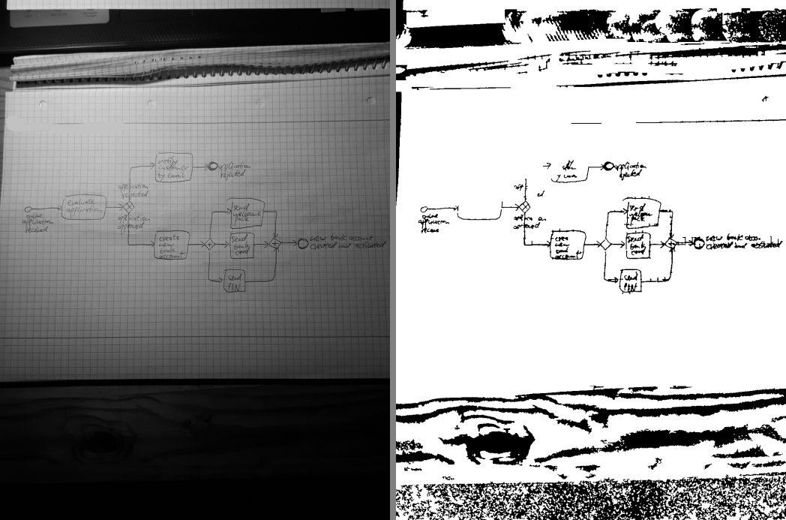

84% of the ink falls outside the detected sheet of paper: the photograph caught the desk around the page and the dark surroundings binarized as stroke. Phase 3.1.2 finds the page correctly here — nothing crops to it, because the primitive pipeline of 3.2 deliberately runs on the whole frame. This is the gallery's argument for wiring page detection into the default chain.

### 2. `ex01_writer0073.ir` — off_page_background

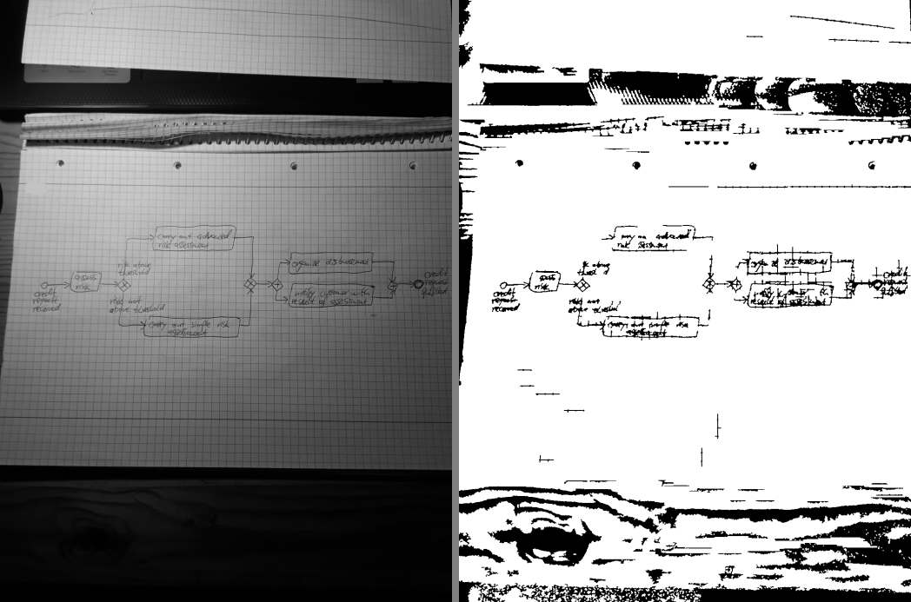

79% of the ink falls outside the detected sheet of paper: the photograph caught the desk around the page and the dark surroundings binarized as stroke. Phase 3.1.2 finds the page correctly here — nothing crops to it, because the primitive pipeline of 3.2 deliberately runs on the whole frame. This is the gallery's argument for wiring page detection into the default chain.

### 3. `ex01_writer0020.ir` — off_page_background

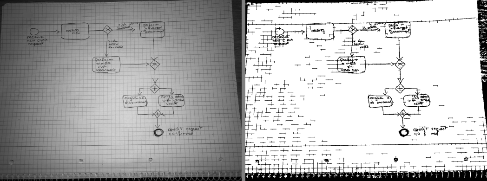

79% of the ink falls outside the detected sheet of paper: the photograph caught the desk around the page and the dark surroundings binarized as stroke. Phase 3.1.2 finds the page correctly here — nothing crops to it, because the primitive pipeline of 3.2 deliberately runs on the whole frame. This is the gallery's argument for wiring page detection into the default chain.

### 4. `ex00_writer0020.ir` — off_page_background

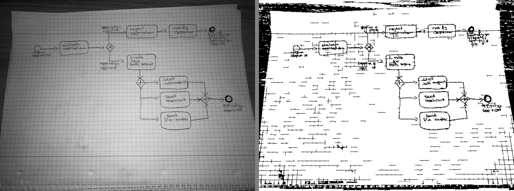

75% of the ink falls outside the detected sheet of paper: the photograph caught the desk around the page and the dark surroundings binarized as stroke. Phase 3.1.2 finds the page correctly here — nothing crops to it, because the primitive pipeline of 3.2 deliberately runs on the whole frame. This is the gallery's argument for wiring page detection into the default chain.

### 5. `ex00_writer0094.ir` — shadow_left

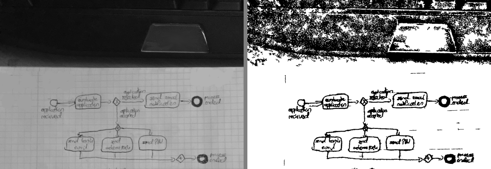

Quadrant brightness spread is still 54 after illumination correction, above Phase 1's own threshold of 20 for calling a photograph shadowed.

### 6. `ex01_writer0013.ir` — off_page_background

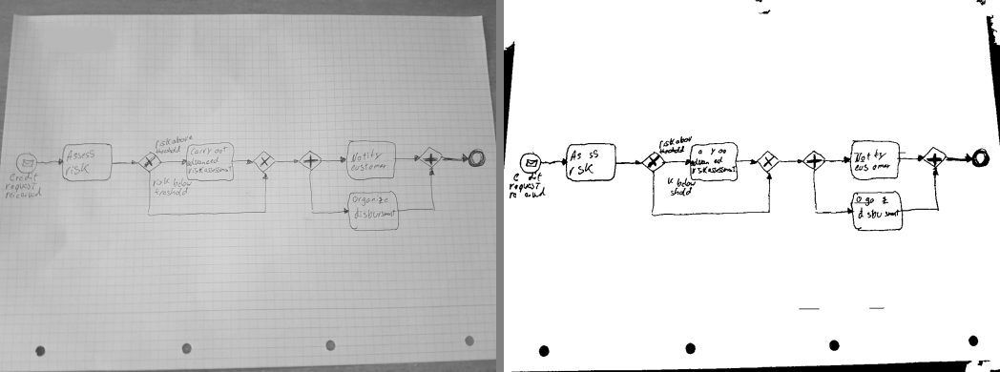

33% of the ink falls outside the detected sheet of paper: the photograph caught the desk around the page and the dark surroundings binarized as stroke. Phase 3.1.2 finds the page correctly here — nothing crops to it, because the primitive pipeline of 3.2 deliberately runs on the whole frame. This is the gallery's argument for wiring page detection into the default chain.

### 7. `ex01_writer0048.ir` — shadow_left

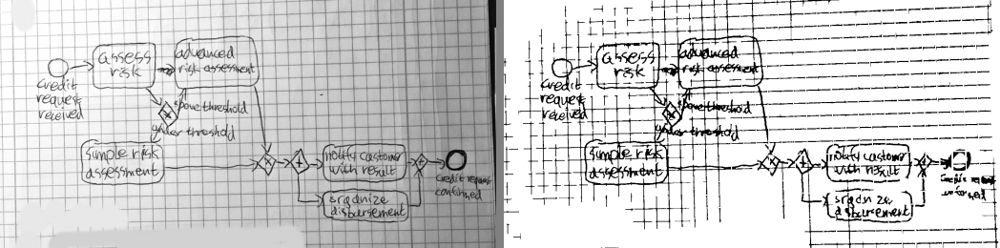

Quadrant brightness spread is still 29 after illumination correction, above Phase 1's own threshold of 20 for calling a photograph shadowed.

### 8. `ex00_writer0096.ir` — shadow_left

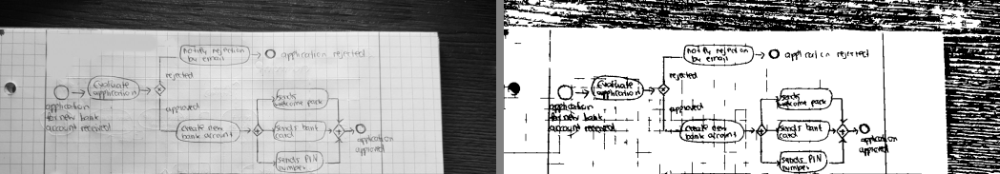

Quadrant brightness spread is still 28 after illumination correction, above Phase 1's own threshold of 20 for calling a photograph shadowed.

### 9. `ex00_writer0078.ir` — off_page_background

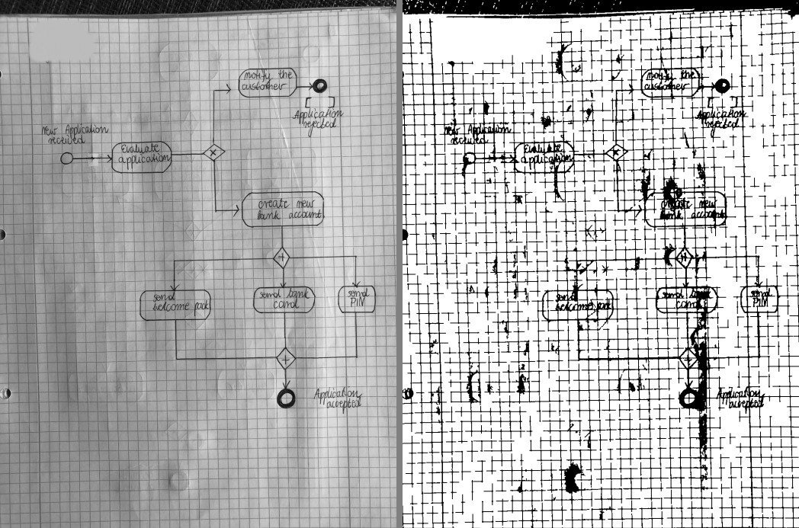

21% of the ink falls outside the detected sheet of paper: the photograph caught the desk around the page and the dark surroundings binarized as stroke. Phase 3.1.2 finds the page correctly here — nothing crops to it, because the primitive pipeline of 3.2 deliberately runs on the whole frame. This is the gallery's argument for wiring page detection into the default chain.

### 10. `ex00_writer0093.ir` — shadow_left

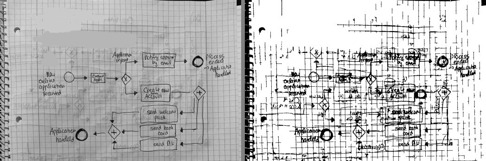

Quadrant brightness spread is still 28 after illumination correction, above Phase 1's own threshold of 20 for calling a photograph shadowed.

### 11. `ex00_writer0048.ir` — shadow_left

Quadrant brightness spread is still 27 after illumination correction, above Phase 1's own threshold of 20 for calling a photograph shadowed.

### 12. `ex01_writer0078.ir` — background_survived

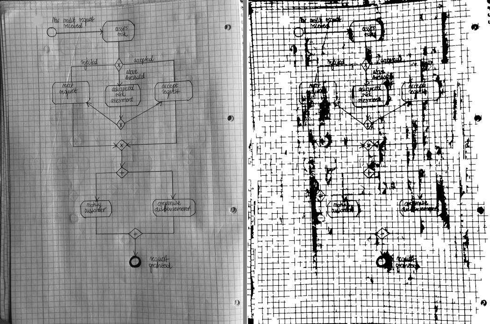

21.8% of the page came out as ink, above the 17% ceiling — paper texture or a shadow edge was thresholded in as stroke.

### 13. `ex01_writer0015.ir` — shadow_left

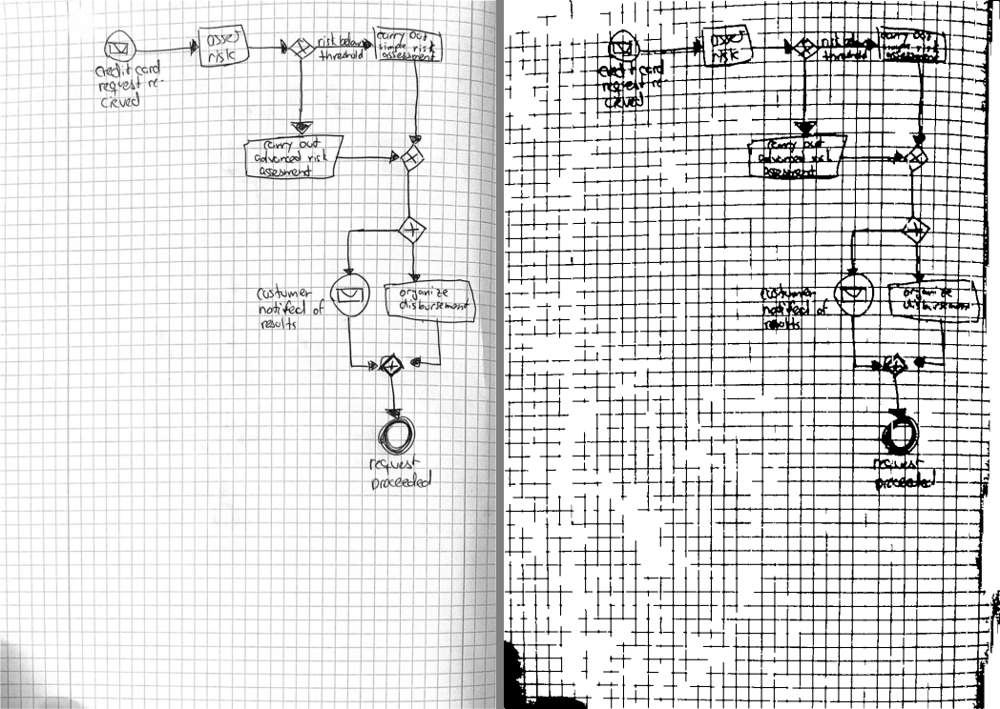

Quadrant brightness spread is still 25 after illumination correction, above Phase 1's own threshold of 20 for calling a photograph shadowed.

### 14. `ex01_writer0058.ir` — fragmented

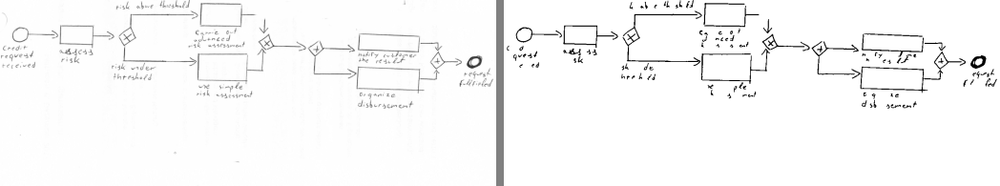

6.1 components per thousand ink pixels against a healthy 1.5: the ink is present but broken into beads, which is what breaks contour extraction and text grouping downstream.

### 15. `ex01_writer0064.ir` — background_survived

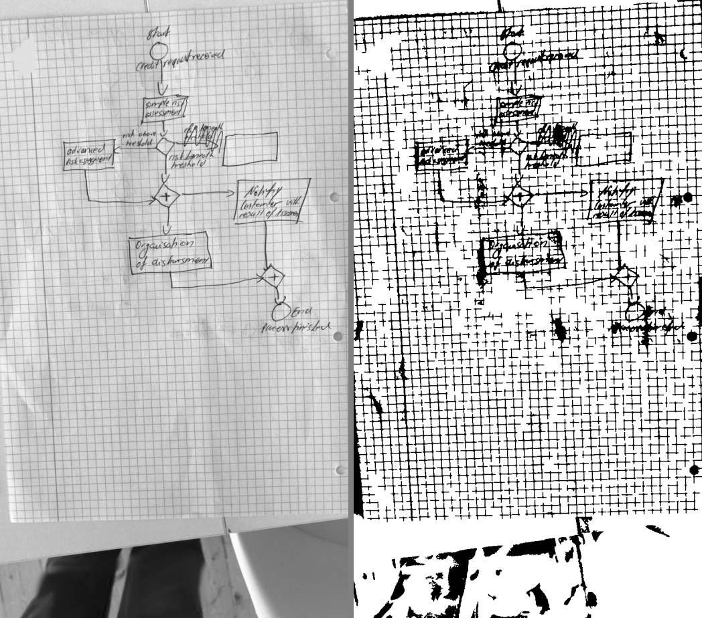

20.0% of the page came out as ink, above the 17% ceiling — paper texture or a shadow edge was thresholded in as stroke.

### 16. `ex01_writer0017.ir` — background_survived

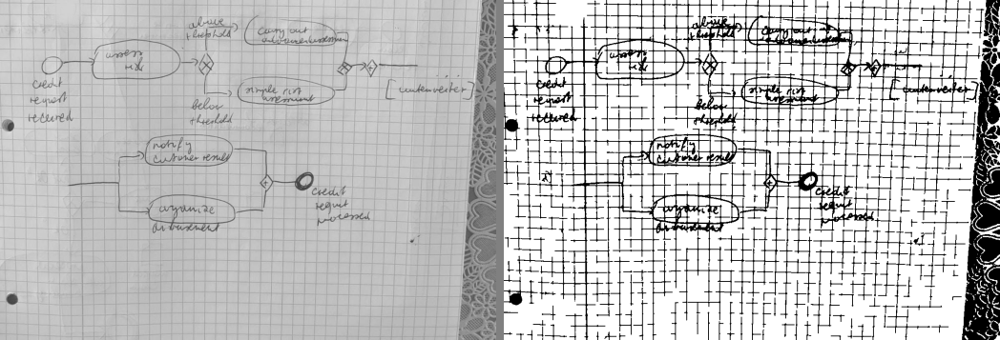

19.2% of the page came out as ink, above the 17% ceiling — paper texture or a shadow edge was thresholded in as stroke.

### 17. `ex00_writer0064.ir` — background_survived

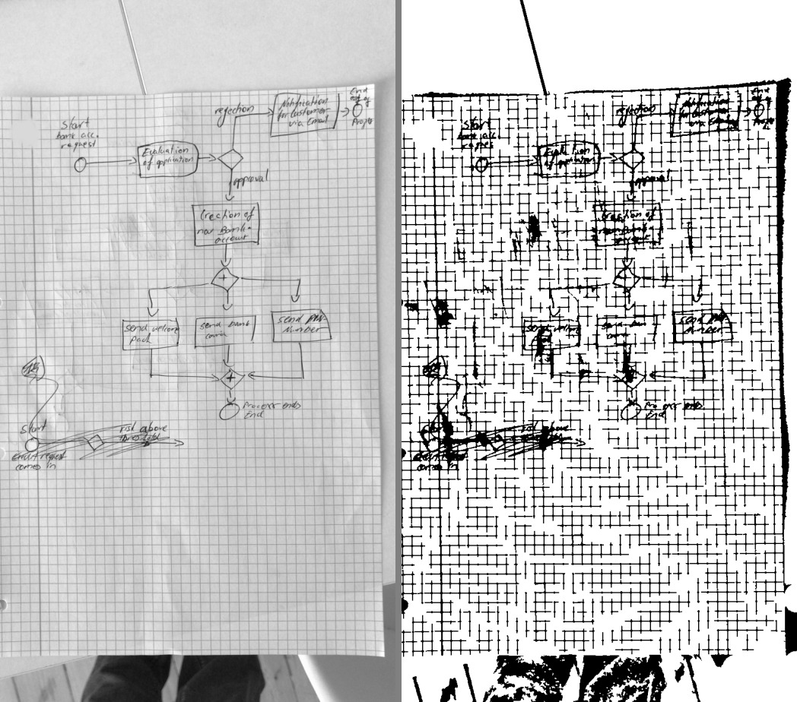

18.9% of the page came out as ink, above the 17% ceiling — paper texture or a shadow edge was thresholded in as stroke.

### 18. `ex01_writer0044.ir` — shadow_left

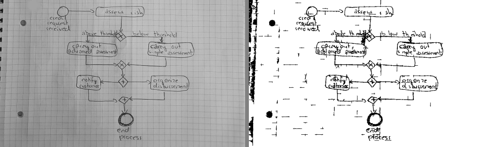

Quadrant brightness spread is still 22 after illumination correction, above Phase 1's own threshold of 20 for calling a photograph shadowed.

### 19. `ex00_writer0031.ir` — fragmented

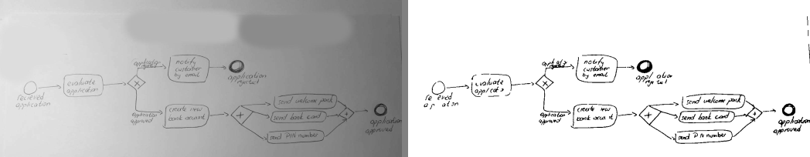

5.5 components per thousand ink pixels against a healthy 1.5: the ink is present but broken into beads, which is what breaks contour extraction and text grouping downstream.

### 20. `ex00_writer0015.ir` — background_survived

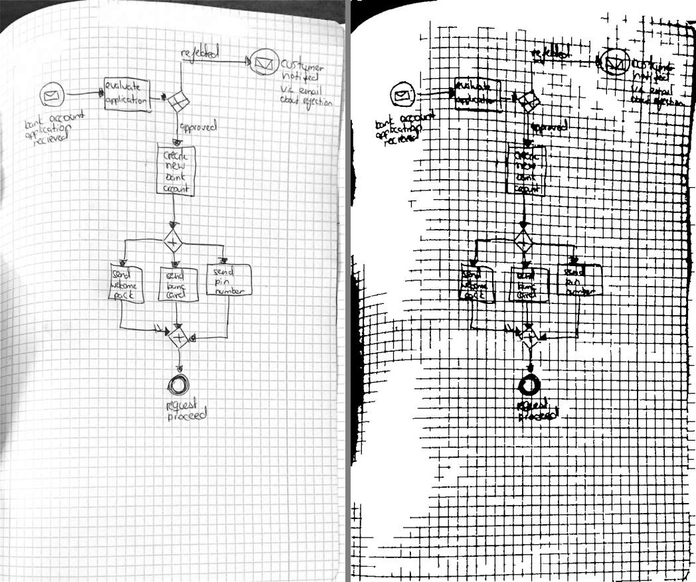

18.5% of the page came out as ink, above the 17% ceiling, and 24% of it lies in straight runs longer than a tenth of the page: this is squared paper whose grid survived 3.1.8. The thumbnails show why — the notebook is not flat, the printed lines bow with the page, and a suppression built on straight structuring elements does not see a curved rule.
