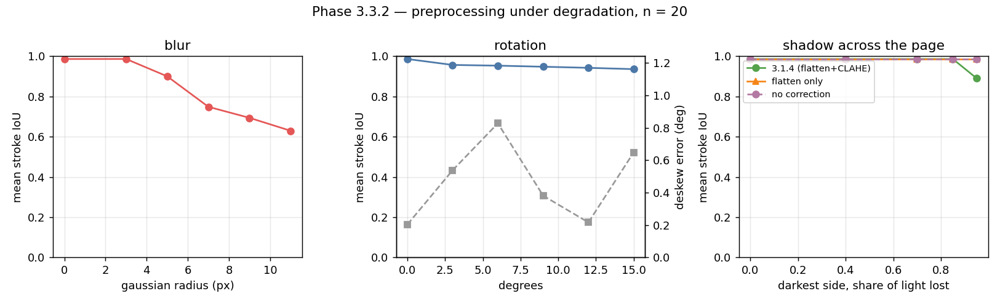

# Phase 3.3.2 — robustness sweep

20 items with exact stroke ground truth. Each degradation is applied
to the clean render at a chosen severity, one at a time, and the whole Phase 3.1
photometric pipeline is run on the result.

## Blur

| gaussian radius (px) | 0 | 3 | 5 | 7 | 9 | 11 |
| :--- | ---: | ---: | ---: | ---: | ---: | ---: |
| mean IoU | 0.99 | 0.99 | 0.90 | 0.75 | 0.69 | 0.63 |

## Rotation

The image and its ground-truth mask are warped by the same matrix, so what is measured
is the pipeline and not a misregistration.

| degrees | 0 | 3 | 6 | 9 | 12 | 15 |
| :--- | ---: | ---: | ---: | ---: | ---: | ---: |
| mean IoU | 0.99 | 0.96 | 0.95 | 0.95 | 0.94 | 0.94 |
| deskew error (deg) | 0.20 | 0.54 | 0.83 | 0.38 | 0.22 | 0.65 |

## Lighting

A shadow falling across the page: full brightness at the left, `1 - s` at the right.
Run three ways — the full 3.1.4 correction, its background-flattening half alone, and
no correction at all.

| share of light lost | 0 | 0.4 | 0.7 | 0.85 | 0.95 |
| :--- | ---: | ---: | ---: | ---: | ---: |
| IoU, 3.1.4 (flatten + CLAHE) | 0.99 | 0.99 | 0.99 | 0.99 | 0.89 |
| IoU, flatten only | 0.99 | 0.99 | 0.99 | 0.99 | 0.99 |
| IoU, no correction | 0.99 | 0.99 | 0.99 | 0.99 | 0.99 |

**A global threshold survives a multiplicative shadow far longer than expected**, and
the reason is arithmetic: Otsu fails only once the shaded paper is darker than the lit
ink, which on this material is past `s = 0.86`. Up to there, correcting the
illumination changes nothing. Past there the *flattening* half of 3.1.4 holds, while
the CLAHE half costs IoU — it amplifies quantisation steps in a region where the paper
has been reduced to a handful of grey levels. On the real photographs of 3.1.4 and
3.1.5, where shading is blotchy rather than a clean ramp and strokes are faint, CLAHE
earns its place; on this synthetic ramp it does not. Both measurements are right about
their own material, and neither generalises to the other on its own.
