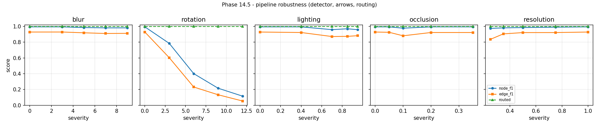

# Phase 14.5 - robustness of the pipeline, not of the binariser

Generated by `python -m src.eval.robust` over 12 held-out test pages (fa_bresler, hdbpmn) in 326.6 s. Every point re-runs the real detector on the degraded pixels and then S5's own assembly, scored against the unchanged truth, so severity 0 reproduces the S5 number on this sample rather than importing it.

## blur

| severity | 0 | 3 | 5 | 7 | 9 |
| :--- | ---: | ---: | ---: | ---: | ---: |
| node_f1 | 0.9936 | 0.9936 | 0.9847 | 0.9808 | 0.9808 |
| edge_f1 | 0.928 | 0.9283 | 0.9183 | 0.9096 | 0.9114 |
| median_ged | 4 | 5.5 | 5.5 | 6 | 6.5 |
| routed | 1 | 1 | 1 | 1 | 1 |

pages per point: 12; stage errors: 0

## rotation

| severity | 0.0 | 3.0 | 6.0 | 9.0 | 12.0 |
| :--- | ---: | ---: | ---: | ---: | ---: |
| node_f1 | 0.9936 | 0.784 | 0.4008 | 0.2156 | 0.1153 |
| edge_f1 | 0.928 | 0.6023 | 0.2311 | 0.1327 | 0.0536 |
| median_ged | 4 | 20 | 40 | 44 | 44.5 |
| routed | 1 | 1 | 1 | 1 | 1 |

pages per point: 12; stage errors: 0

## lighting

| severity | 0.0 | 0.4 | 0.7 | 0.85 | 0.95 |
| :--- | ---: | ---: | ---: | ---: | ---: |
| node_f1 | 0.9936 | 0.9936 | 0.9582 | 0.9693 | 0.9579 |
| edge_f1 | 0.928 | 0.922 | 0.8709 | 0.8734 | 0.8816 |
| median_ged | 4 | 5 | 8.5 | 7.5 | 7 |
| routed | 1 | 1 | 1 | 1 | 1 |

pages per point: 12; stage errors: 0

## occlusion

| severity | 0.0 | 0.05 | 0.1 | 0.2 | 0.35 |
| :--- | ---: | ---: | ---: | ---: | ---: |
| node_f1 | 0.9936 | 0.9936 | 0.9769 | 0.9936 | 0.9936 |
| edge_f1 | 0.928 | 0.9247 | 0.8804 | 0.922 | 0.922 |
| median_ged | 4 | 5.5 | 5.5 | 6 | 6 |
| routed | 1 | 1 | 1 | 1 | 1 |

pages per point: 12; stage errors: 0

## resolution

| severity | 0.25 | 0.35 | 0.5 | 0.75 | 1.0 |
| :--- | ---: | ---: | ---: | ---: | ---: |
| node_f1 | 0.974 | 0.9808 | 0.9847 | 0.9896 | 0.9936 |
| edge_f1 | 0.835 | 0.9047 | 0.921 | 0.9214 | 0.928 |
| median_ged | 7 | 7 | 5.5 | 4.5 | 4 |
| routed | 1 | 1 | 1 | 1 | 1 |

pages per point: 12; stage errors: 0
